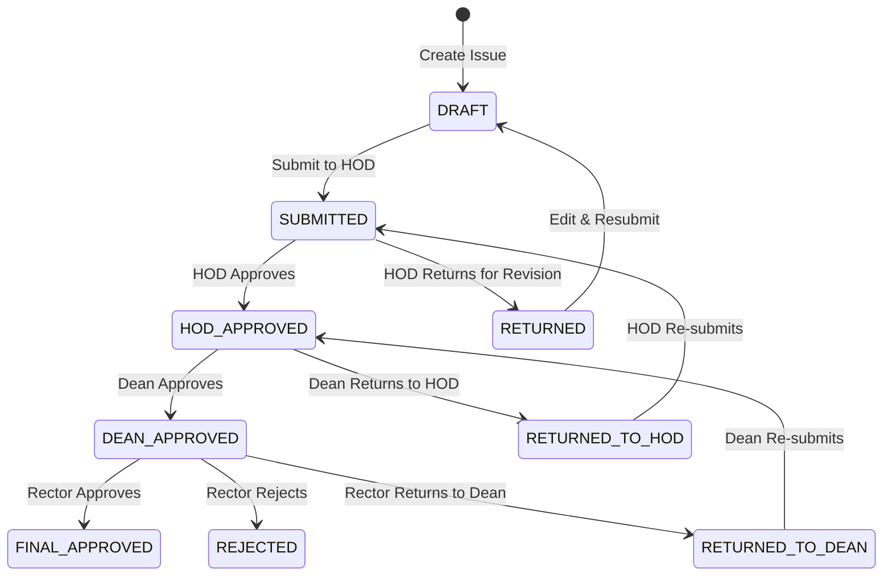

# Academic Information Management System (AIMS) — Enterprise Portal 🚀

AIMS is a state-of-the-art administrative coordination portal designed for academic institutions to streamline **Issue Escalation Lifecycles**, **Official Board Meetings (BOS, BOF, DCM)**, and **Internal Audit Compliance**. 

The system replaces legacy paper processes and disjointed emails with an integrated **Glassmorphic Workflow Portal**, featuring real-time synchronization, interactive charts, dynamic calendar mappings, and automated audit trails.

---

## 🏛️ System Architecture & Workflow Engine

AIMS implements a strict hierarchical workflow matching the official command structure of the university. Users are mapped to four core roles:
1. **Teacher**: Submits academic, infrastructure, or operational issues to their department.
2. **Head of Department (HOD)**: Approves department issues, schedules Board of Studies (BOS) meetings, and escalates to the Faculty Dean.
3. **Dean**: Reviews escalated issues across the faculty, schedules Board of Faculty (BOF) meetings, and escalates to the Rector.
4. **Rector**: Oversees global institutional issues and chairs the Deans Committee Meetings (DCM).

### 🔄 The Issue Escalation State Machine
Issues follow a strictly validated state machine transition lifecycle:



---

## 🌟 Core System Modules & Enhancements

### 1. 📈 Visual Dashboard Analytics
- Powered by **Chart.js** with asynchronous data loads.
- Displays responsive, comparative metric charts representing issue counts grouped by department and faculty.
- Delivers real-time numerical counters matching the active user's roles (e.g. pending reviews, scheduled meetings).

### 2. ⚡ Real-Time Notification Engine (WebSockets)
- Built on top of **Django Channels**, **Daphne**, and **redis/in-memory channel layer**.
- **Instant Toasts**: Displays interactive desktop toast notifications the moment leadership takes an action (approves, rejects, or schedules a meeting).
- **Synchronized Read Status**: Marking notifications as read dynamically updates the bell badge count across all open browser tabs simultaneously using WebSocket broadcast frames.
- **State Restoration**: On socket connection, the system automatically synchronizes unread notifications state dynamically without page reloads.

### 3. 📅 Interactive Meetings Calendar Widget
- Integrates **FullCalendar.js** into the meetings dashboard.
- Displays scheduled Board of Studies (BOS), Board of Faculty (BOF), and Deans Committee Meetings (DCM) visually.
- **Status Color-Coding**:
  - `Purple (#8b5cf6)`: Scheduled / Upcoming Meetings
  - `Green (#10b981)`: Concluded / Completed Meetings
  - `Red (#ef4444)`: Cancelled Meetings
- Hover tooltips display locations, organizer names, and quick action detail links.

### 🔍 4. Unified Search & Filter Explorer
- A dynamic, two-column grid explorer built using AJAX partial renders.
- **Debounced Live Search**: Filters listings on keypresses with a 250ms client-side debounce to prevent server query flooding.
- **Advanced Filtering Controls**: Supports query filtering by keyword search, status, departments, date ranges, and creator names.
- **Dynamic Role Scope**:
  - Teachers only see their own issues.
  - HODs see all issues in their department.
  - Deans see all issues in their faculty.
  - Rector sees all active issues globally.

### 📄 5. Automated PDF Report Exports
- Integrates **ReportLab** to generate official, archive-grade PDF reports.
- **Content Rendered**: Document title, metadata grid table, issue descriptions, official note archives (HOD, Dean, and Rector comments), and the full chronological timeline log.
- Accessible directly on the Issue Details page (for Teachers) and Issue Review page (for Leadership).

### 💾 6. Client-Side Local Draft Auto-Save
- Runs a background interval loop every **5 seconds** to backup forms.
- Automatically restores draft data when the page loads, presenting a confirmation toast: *"Draft restored from local save!"*.
- Clears the browser's local cache automatically upon successful form submission to prevent input collision.

### 📂 7. Google Drive Cloud Storage Integration
- Configured via `django-googledrive-storage` to stream minutes attachments straight to the cloud.
- **Folder Root Binding**: Assets are uploaded to your specific Google Drive Folder ID: `1AzknkatYu78KxWR0eqpUbHA4m81fRQc-`.
- **Conditional Fallback**: If the `google_drive_credentials.json` credential file is present, GDrive is active; otherwise, it falls back to local file system storage.

---

## 🛠️ Technical Stack & Dependencies

- **Framework**: Python 3.12+ / Django 6.0
- **Asynchronous Server**: Daphne (ASGI protocol handling WebSockets)
- **WebSockets Layer**: Django Channels 4.3
- **PDF Generation**: ReportLab 5.0
- **Cloud Storage**: django-googledrive-storage 1.6
- **Database**: PostgreSQL (Production) / SQLite (Local)
- **Frontend Components**: Vanilla HTML5, CSS3 Variables, Glassmorphism Backdrop Blurs, JavaScript (ES6)

---

## 📦 Local Installation & Deployment Guide

Follow these steps to deploy and run the project locally:

### 1. Clone & Set Up Virtual Environment
```bash
git clone https://github.com/zaingillani09/aims-fyp.git
cd aims-fyp
python -m venv venv
.\venv\Scripts\activate
```

### 2. Install Packages
```bash
pip install -r requirements.txt
```

### 3. Setup Environment Variables (`.env`)
Create a `.env` file in the project root:
```env
DEBUG=True
SECRET_KEY=your-django-secret-key
DB_NAME=aims_db
DB_USER=postgres
DB_PASSWORD=your-postgres-password
DB_HOST=127.0.0.1
DB_PORT=5432
```

### 4. Database Migrations
```bash
python manage.py migrate
```

### 5. Running the Daphne Development Server (ASGI)
To run with support for WebSockets, use daphne to serve the ASGI entrypoint:
```bash
daphne aims.asgi:application
```
Alternatively, for standard HTTP development:
```bash
python manage.py runserver
```

---

## 📜 Database Model Schema

Below is the database representation of the core models in the system:

### 1. `User` (extends AbstractUser)
- `role`: Choices (`TEACHER`, `HOD`, `DEAN`, `RECTOR`)
- `primary_department`: Foreign Key to `Department`
- `hod_of`: One-to-One with `Department` (Null for non-HODs)
- `dean_of`: One-to-One with `Faculty` (Null for non-Deans)

### 2. `Issue`
- `title`: CharField
- `description`: TextField
- `status`: CharField (State choices)
- `department`: ForeignKey to `Department`
- `created_by`: ForeignKey to `User`
- `created_at`: DateTimeField
- `is_active`: BooleanField (Used for soft deletes)

### 3. `IssueHistory`
- `issue`: ForeignKey to `Issue`
- `action`: CharField (e.g. "HOD Returned for Revision")
- `actor`: ForeignKey to `User`
- `notes`: TextField
- `created_at`: DateTimeField

### 4. `Meeting`
- `date`: DateField
- `time`: TimeField
- `location`: CharField
- `organizer`: ForeignKey to `User`
- `attendees`: ManyToMany to `User`
- `minutes_attachment`: FileField (Uploads to Google Drive or local storage)
- `status`: Choices (`SCHEDULED`, `CONCLUDED`, `CANCELLED`)
