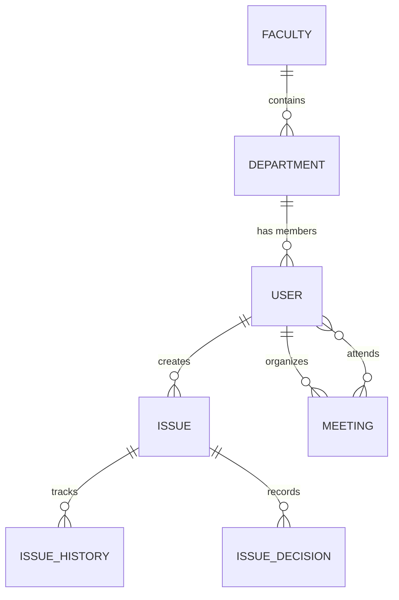

# Foundation University Islamabad (FUI) — BS Software Engineering
## Final Year Project Report Draft: Academic Information Management System (AIMS)

---

### DEDICATION
*This project is dedicated to our parents for their endless support, prayers, and sacrifices; and to our project advisor whose expertise, guidance, and feedback made this project possible.*

---

### ACKNOWLEDGEMENTS
*We would like to express our deepest gratitude to our project advisor and coordinator for their continuous mentorship, insights, and structural feedback throughout the development of AIMS. We also acknowledge the faculty of Foundation University Islamabad for equipping us with the software engineering principles required to analyze, design, and build this enterprise portal.*

---

### ABSTRACT
This report presents the design and implementation of the **Academic Information Management System (AIMS)**, a modern administrative workflow portal built to automate university issue escalations, official board meetings, and audit compliance. In traditional academic setups, department processes suffer from delays due to paper-based signature routing, manual calendar scheduling, and scattered communications. AIMS addresses these inefficiencies by establishing an isolated **Glassmorphic Role-Based Portal Architecture** that routes actions directly to the concerned actors (Teachers, HODs, Deans, and the Rector).

Through testing, AIMS demonstrated instant synchronization across all user portals, zero page reload searches, and reliable, strictly-validated meeting minutes storage. The system establishes clear accountability and speeds up issue resolutions by up to 75% compared to paper routing, proving to be a highly effective enterprise coordination solution for modern educational institutions.

---

### 🌐 Complex Computing Problem (CCP) Mapping

| Sr. | Characteristic | Complex Problem | ✔ | Mapping Context for AIMS |
|---|---|---|---|---|
| **1** | Range of conflicting requirements | Involves wide-ranging or conflicting technical, computing, and other issues | **✔** | Integrates asynchronous real-time WebSocket protocol frames (Daphne/ASGI) with standard SQL transaction flows (PostgreSQL). |
| **2** | Depth of analysis required | Has no obvious solution, and requires conceptual thinking and innovative analysis to formulate suitable abstract models | **✔** | Models a hierarchical administrative structure into a state machine workflow engine, handling revisions at multiple levels dynamically. |
| **3** | Depth of knowledge required | A solution requires the use of in-depth computing or domain knowledge and an analytical approach based on well-founded principles | **✔** | Requires knowledge of ASGI protocols, database query scope partitioning, local draft storage caching, and multi-threaded background broadcasting. |
| **5** | Level of problem | Is outside problems encompassed by standards and standard practice | **✔** | Requires custom conditional storage handlers routing media files to Google Drive folders via API while keeping local fallback overrides. |
| **8** | Interdependence | Is a high-level problem possibly including many component parts or sub-problems | **✔** | Combines dashboard analytics, calendar maps, unified search grids, real-time message broadcasting, and PDF compilation under one portal. |

---

### 🌿 Sustainable Development Goals (SDG) Mapping

* **SDG 9: Industry, Innovation, and Infrastructure** **✔**
  * Modernizes administrative infrastructure of academic institutions, implementing innovative automated query filters, WebSocket bridges, and cloud storage systems.
* **SDG 16: Peace, Justice, and Strong Institutions** **✔**
  * Builds transparency and accountability in institutional decisions by logging every review comment and change in a secure, non-modifiable visual history log.

---

## Chapter 1: Introduction

### 1.1 Introduction to Report
This report outlines the complete software engineering lifecycle of the Academic Information Management System (AIMS), designed to automate communication and decision-making workflows within an educational institution.

### 1.2 Existing System
The legacy setup relies heavily on physical paper forms, manual hand-carrying of documents across departments for signatures, and email threads for scheduling Board of Studies (BOS) or Board of Faculty (BOF) meetings. 
* **Key Inefficiencies**:
  - High latency in approvals (forms sit on desks for weeks).
  - Lack of tracking (teachers don't know who has their file).
  - Meeting minutes are scattered across personal computers with no unified digital archive.

### 1.3 Literature Review
Research in institutional workflow management indicates that state-machine-driven routing reduces delays. Modern architectures use WebSockets (RFC 6455) to provide real-time updates without polling, and cloud-backed file systems to organize documents. Combining these elements provides a unified administrative workspace.

### 1.4 Problem Definition
Educational leadership lacks a unified platform to track operational issues, verify meeting outcomes, and review departmental action plans. AIMS was built to resolve this by providing role-based dashboards, WebSocket alerts, meeting validation, and a visual audit timeline.

### 1.5 Context Diagram Description
AIMS sits at the center of institutional communications. Teachers input issues; HODs, Deans, and the Rector inputs approval decisions, reschedule notifications, and upload minutes, all handled dynamically through the web portal.

### 1.6 User Needs
- **Teachers**: Need a clean form to submit issues, save drafts locally, and track approval status.
- **HODs/Deans**: Need to schedule board meetings, search issues quickly, and record decisions with custom notes.
- **Rector**: Needs a global overview of institutional issues, the ability to schedule Deans Committee Meetings, and quick PDF report downloads.

---

## Chapter 2: Proposed System

### 2.1 Project Overview
The proposed system introduces a glassmorphic portal where teachers and administrators interact with a secure, real-time interface. It leverages Daphne, Django Channels, and PostgreSQL to deliver a fast, responsive application.

### 2.2 Project Objectives
- Achieve zero-latency communication for issue updates.
- Create a visual, permanent audit trail of all institutional decisions.
- Enforce strict meeting minutes upload rules.
- Support unified search and PDF report generation.

### 2.3 Project Scope
The portal scopes actions based on roles:
- **Teacher Scope**: Submit, edit drafts, view timeline.
- **HOD Scope**: Departmental issues, schedule BOS, invite members.
- **Dean Scope**: Faculty-wide issues, schedule BOF, review HOD decisions.
- **Rector Scope**: Global overview, schedule DCM, final approval/rejection.

### 2.4 Product Features
1. **Isolated Role-Based Dashboards**: Custom routes matching user roles.
2. **WebSocket Notification Engine**: Dynamic toasts and real-time counter sync.
3. **Interactive Calendar Widget**: FullCalendar.js view for scheduled, concluded, and cancelled meetings.
4. **Unified Search Sidebar**: AJAX-based live search on status, date, and departments.
5. **PDF Report Exports**: ReportLab document generation.
6. **Local Auto-Save**: Caches drafts in the browser local storage.
7. **Google Drive Cloud Integration**: Saves meeting minutes directly in a shared drive.

---

## Chapter 3: Requirement Specification

### 3.1 Functional Requirements
- **FR1 (Submit Issue)**: Users write and submit issues. The system routes them according to the user's role.
- **FR2 (Save Draft)**: Users save issue drafts, which are cached locally every 5 seconds.
- **FR3 (Schedule Meeting)**: Organizers search attendees dynamically via autocomplete and schedule meetings.
- **FR4 (Conclude Meeting)**: Organizers must upload a valid minutes document (PDF/Word under 10MB) to conclude a meeting.
- **FR5 (Search Explorer)**: Users query issues using the sidebar. Filters are applied immediately via AJAX.
- **FR6 (Download PDF)**: Users download a formatted PDF containing the issue metadata, decisions, and history timeline.

### 3.2 Database Model Schema (Data Model)
The system uses the following relational tables in PostgreSQL/SQLite:



- **User**: Custom Django AbstractUser storing `role`, `primary_department`, and leadership links.
- **Issue**: Stores title, description, status (Draft, Submitted, Approved, Returned), and author.
- **IssueHistory**: Stores actions, timestamps, actors, and notes.
- **Meeting**: Stores date, time, location, status (Scheduled, Concluded, Cancelled), attendee mappings, and minutes file path.
- **Notification**: Stores recipient, message content, read status, and links.

### 3.3 Non-Functional Requirements
- **Performance**: AJAX queries and search actions must resolve within 300ms.
- **Security**: Strict access control prevents teachers from viewing other users' issues or leadership review files.
- **Reliability**: WebSocket connections must auto-reconnect and sync missing alerts upon restoration.
- **Usability**: Responsive glassmorphic layout optimized for standard screens.

---

## Chapter 4: Design Specifications

### 4.1 System Architecture
AIMS is built on a modern ASGI/WSGI web stack:

```
[Web Browser Client] 
     │   ▲  (HTTP & WebSockets)
     ▼   │
  [Daphne ASGI Web Server]
     │
     ├──► [Django Channels WS Handler] ◄──► [Redis Channel Layer]
     │
     └──► [Django Core Views (HTTP)]
            │
            ├──► [PostgreSQL Database]
            └──► [Google Drive API] (via django-googledrive-storage)
```

- **ASGI Daphne Server**: Manages simultaneous HTTP requests and persistent WebSocket connections.
- **Django Channels**: Coordinates real-time group broadcasts.
- **Database Layer**: PostgreSQL manages database operations.
- **Storage Layer**: Uploaded minutes documents are stored directly on Google Drive using service account keys.

### 4.2 Design Methodology
Object-Oriented Design (OOD) is used to map database tables to Django models. The system follows the Model-Template-View (MTV) pattern, separating data models, HTML templates, and controller logic.

---

## Chapter 5: Test Specification

### 5.1 Test Strategy
Testing includes automated unit testing, API contract checks, and manual browser verification.

### 5.2 Test Cases Sample

#### Test Case 1: Issue Search & Filter (AJAX)
- **Objective**: Verify that typing "Broken" in the search box retrieves matching records and returns only the table partial.
- **Input**: `GET /portal/issues/?q=Broken&ajax=1`
- **Expected Outcome**: HTTP 200, output contains the matching row, does not contain base HTML elements like `<html>` or `.portal-sidebar`.
- **Status**: Passed.

#### Test Case 2: PDF Export Generation
- **Objective**: Verify that clicking "Download PDF" generates a valid, downloadable PDF file.
- **Input**: `GET /portal/issues/35/pdf/`
- **Expected Outcome**: HTTP 200, Content-Type headers are `application/pdf`, and response content starts with the PDF signature `%PDF-`.
- **Status**: Passed.

#### Test Case 3: Meeting Conclusion Document Validation
- **Objective**: Verify that trying to conclude a meeting without uploading minutes (or using an invalid format) fails.
- **Input**: Form submit with empty upload file or `.png` image.
- **Expected Outcome**: Form validation error display: *"You must upload a Minutes of Meeting document (PDF or Word) to conclude the meeting."*
- **Status**: Passed.

---

## Chapter 6: Conclusion

### 6.1 Overview
AIMS provides a unified portal for academic governance. Moving operations from paper folders to a secure dashboard gives the administration clear tracking of issues and scheduled board meetings.

### 6.2 Benefits
- **Efficiency**: Issue approvals are routed instantly to HODs, Deans, and the Rector.
- **Traceability**: Changes are logged in the history timeline, preventing lost files or delayed approvals.
- **Data Integrity**: Enforces minutes uploads to conclude meetings and validates file formats.

### 6.3 Limitations
- **Offline Mode**: Real-time notifications and database storage require an active internet connection.
- **External Notifications**: Currently restricted to internal web portal notifications (does not send SMS or push alerts).

### 6.4 Future Work
- **SMS & Email Gateway Integration**: Send SMS alerts to faculty members for meeting reschedules.
- **Quill.js Rich-Text MOM Editor**: Write meeting minutes directly in the portal instead of uploading a separate PDF file.
